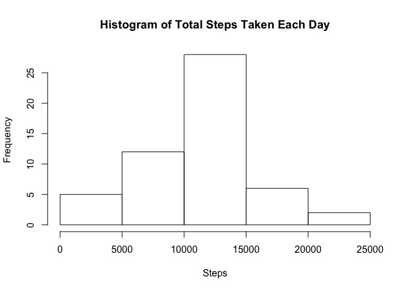
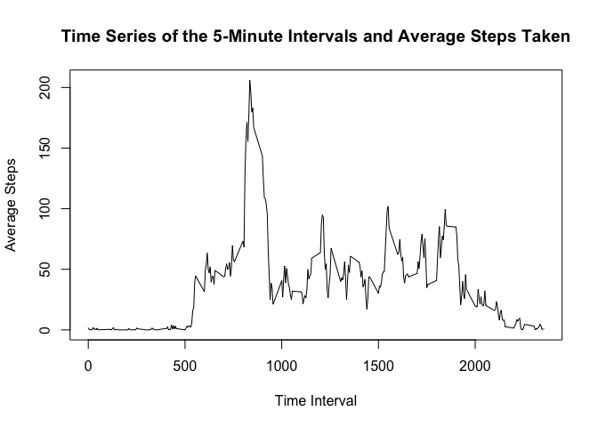
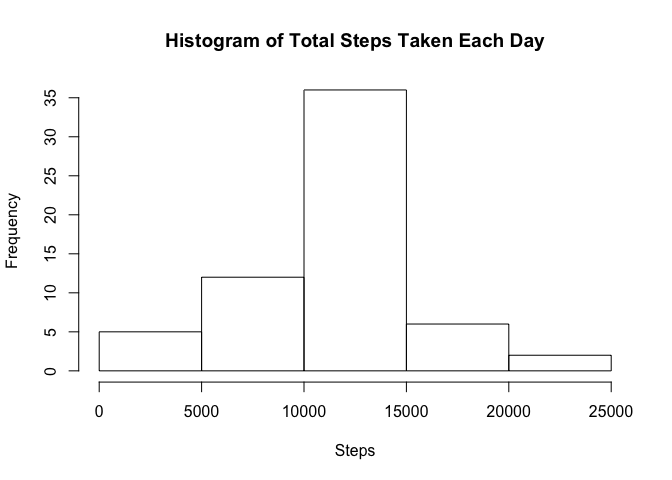
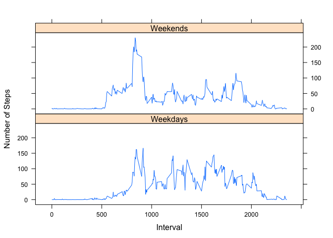

# Reproducible Research: Peer Assessment 1


## Loading and preprocessing the data

```r
data <- read.csv("activity.csv")
```

## What is mean total number of steps taken per day?

```r
sumByDate <- aggregate(. ~ data$date, data = data, sum)
hist(sumByDate$steps, main = "Histogram of Total Steps Taken Each Day", xlab = "Steps")
```

 

```r
meansteps <- mean(sumByDate$steps, na.rm = TRUE)
mediansteps <- median(sumByDate$steps, na.rm = TRUE)
```
### Mean number
The mean total number of steps taken per day is 1.0766189\times 10^{4}

### Median number
The median total number of steps taken per day is 10765


## What is the average daily activity pattern?
### Time series plot

```r
sumByInt <- aggregate(.~data$interval, data = data, mean)
plot(sumByInt$interval, sumByInt$steps,type = "l", 
     main = "Time Series of the 5-Minute Intervals and Average Steps Taken",
     xlab = "Time Interval",
     ylab = "Average Steps")
```

 

### Which 5-minute interval, on average across all the days in the dataset, contains the maximum number of steps?

```r
maxInt <- sumByInt$interval[which.max(sumByInt$steps)]
```

The interval is 835, and the maximum number is 206.1698113

## Imputing missing values

```r
nanumbers <- sum(is.na(data$steps))
```

The number of NAs is 2304

### Create a new dataset filling in the NAs with their intervals' mean.


```r
# Add a column showing the interval average for each row of data
df <- merge(x = data, y = sumByInt, by = "interval", suffixes = c("", ".Avg"))[,c(1,2,3,5)]

# Reorder data frame by date like original dataset
df <- df[with(df, order(date)), ]

# Replace the NA rows with the average from the new column
rowNas <- is.na(data$steps)
df$steps[rowNas] <- df$steps.Avg[rowNas]

# Remove the extra average column
df <- df[,1:3]

# Rename the row names of the new data frame
row.names(df) <- 1:nrow(df) 

# Make the histogram
sumByDate2 <- aggregate(.~df$date, data = df, sum)
hist(sumByDate2$steps, 
     main = "Histogram of Total Steps Taken Each Day", 
     xlab = "Steps"
     )
```

 

```r
# Calculate mean and median
meanSteps2 = mean(sumByDate2$steps)
medianSteps2 = median(sumByDate2$steps)
```

### Calculate mean and median

The mean of the total number of steps taken each day is 1.0766189\times 10^{4}
The median of the total number of steps taken each day is 1.0766189\times 10^{4}

## Are there differences in activity patterns between weekdays and weekends?
### Create a new data frame with a new factor

```r
# Change the date column to POSIXlt format
df$date <- as.POSIXlt(df$date)

# Creates a vector that is TRUE if the date falls on a weekend
df <- cbind(df, (weekdays(df$date) == "Sunday" | weekdays(df$date) == "Saturday"))


# changes the column names
colnames(df) <- c("interval", "steps", "date", "dayType")

library(plyr)

df.w <- ddply(df, c("interval", "dayType"), summarize, outVal = mean(steps))

df.w$dayType <- as.factor(df.w$dayType)

levels(df.w$dayType <- c("Weekends", "Weekdays"))
```

```
## NULL
```

### Make the plot


```r
library(lattice)
xyplot(outVal ~ interval | dayType, data = df.w, type = "l", layout = c(1,2), ylab = "Number of Steps", xlab = "Interval")
```

 

```
